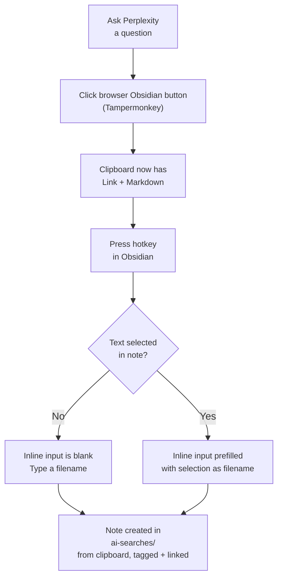

# Perplexity Saver

[](https://github.com/notuntoward/obsidian-perplexity-saver/actions/workflows/build.yml)
[](https://github.com/notuntoward/obsidian-perplexity-saver/actions/workflows/codeql.yml)
[](https://github.com/notuntoward/obsidian-perplexity-saver/actions/workflows/scorecard.yml)

Ask AI a research question, then save the entire conversation into your
vault with one click and one keystroke — automatically filed into a linked,
tagged note next to whatever you're currently writing. No copy-pasting, no
manual file creation, no frontmatter editing.  



# Which AI?
## Perplexity

You can export single perplexity resposes from the default perplexity page, But full dialogs are available if you install the Complexity chrome plubin, a Perplexity companion plugin; a little more convenience can be had by also installing a small chrome tampermonkey script.

## Gemini

Whole dialogs are capturable when you install the obsidian web clipper browser plugin and set it to store to your clipboard

# Full workflow

1. **(Browser)** Ask your question(s) in Perplexity as normal.
2. **(Browser)** Click the "📋 Copy for Obsidian" button. This copies a
   Markdown version of the conversation, with a link back to the original
   Perplexity thread, to your clipboard.
3. **(Obsidian)** Place your cursor in the note you're writing, where you want
   a link to the saved note to appear.
4. **(Obsidian)** Press your assigned hotkey. An inline input field appears at
   your cursor position.
5. **(Obsidian)** Type a filename in the inline input. You can click elsewhere
   in the note to copy text, then return to the input to paste it — the input
   stays open and doesn't block interaction with the rest of the editor.
6. **(Obsidian)** Press Enter. The input is replaced with a link to the newly
   created note.

The note **content** always comes from the clipboard (the Perplexity
conversation you copied). The plugin automatically creates a subfolder (default:
`ai-searches`) in the same folder as your current note (if it doesn't already
exist), saves the clipboard content into a new note there, tags it (default:
`ai-generated`), and inserts a link to it at your cursor position.

## Using selected text as the filename

If you have text selected in your note when you run the command, the plugin
uses the selected text as a suggested filename: the selection is deleted and the
inline input is pre-filled with it (auto-selected, so you can type over it
immediately). The note content still comes from the clipboard, not from the
selection. This is handy when you want the new note's name to match nearby text
in your current note.

Selecting text is purely a filename convenience — it never changes what gets
saved into the note body.

# Settings

- **AI save folder** (default: `ai-searches`) — The name of the subfolder where
  saved Perplexity notes are stored. It is automatically created in the same folder
  as the currently active note.
- **AI generated tag** (default: `ai-generated`) — The tag pushed into the frontmatter
  tags property of every saved AI note.

# Setup

## A. Obsidian plugin setup

1. Download or build this plugin (see "Building from source" below).
2. Copy the plugin folder into `<your vault>/.obsidian/plugins/`.
3. In Obsidian, go to Settings → Community plugins, disable Restricted mode if
    needed, refresh the plugin list, and enable "Perplexity Saver."
4. Go to Settings → Hotkeys, search "Save Perplexity Note," and assign a
   hotkey (e.g. Ctrl+Shift+V).


## B. Tampermonkey script (Perplexity)

This works by pairing a small browser helper with this plugin — the browser
side copies the conversation in the right format, and this plugin handles
creating the note, tagging it, and linking it back into your current note.

To get the one-click experience above, you need two quick installs: a browser
script (2 minutes) and this plugin.

#### Tampermonkey browser setup

1. Install the [Tampermonkey](https://www.tampermonkey.net/) browser extension.
2. Install the
   [Complexity](https://github.com/pnd280/complexity) Chrome extension, which
   adds full multi-turn dialog export to Perplexity's UI.
3. Open Tampermonkey's dashboard, click "Create a new script," and replace the
   contents with
   [`browser-userscript/perplexity-obsidian-exporter.user.js`](./browser-userscript/perplexity-obsidian-exporter.user.js)
   from this repo. Save it.
4. In Chrome, go to `chrome://extensions` → **Tampermonkey** → **Details**:
   - Set **Site access** to **On all sites** (or explicitly allow
     `https://www.perplexity.ai`).
   - Turn on **Allow user scripts**.
   - Confirm Tampermonkey itself is enabled.
5. Visit perplexity.ai — you should see a small "📋 Copy for Obsidian" button
   appear in the bottom-right corner of the page.

## C. Obsididan web clipper (for Gemini)

Install the official **Obsidian Web Clipper** from your browser’s extension store and pin it to the toolbar.

On any page, open the clipper, select **Settings** (gear), and set the destination/action to **Clipboard**. Then choose **Copy** to place the generated Markdown on your clipboard, ready to paste anywhere, but don't paste, use this plugin to save the dialog instead.


# Building from source

Requires [Node.js](https://nodejs.org).

```
npm install
npm run build
```
This produces `main.js`. Copy `manifest.json` and the built `main.js` into
`<your vault>/.obsidian/plugins/perplexity-saver/`.

# Troubleshooting

## First checks

If the button does not appear on Perplexity, check these before anything else:

1. Open a Perplexity tab, click the Tampermonkey extension icon, and make sure
   this script is shown as active/running.
2. Go to `chrome://extensions` → **Tampermonkey** → **Details**:
   - Confirm Tampermonkey is enabled.
   - Set **Site access** to **On all sites** (or explicitly permit
     `https://www.perplexity.ai`).
   - Turn on **Allow user scripts**.
3. In the Tampermonkey Dashboard, make sure the script's enable toggle is on,
   then reload Perplexity with a full reload: `Ctrl+Shift+R`.

A Chrome update can reset these permissions. If site access is set to **On
click**, the script cannot inject the button automatically.

### Confirm the script is running

Open the browser's developer tools (`F12`) and switch to the **Console** tab.
When you reload Perplexity you should see a line like:

```
[PPLX Obsidian exporter] userscript started https://www.perplexity.ai/...
```

If the line does not appear, the script is not being injected at all — go back
to the First checks section above. If the line appears but the button is still
missing, look for a red error in the Console and report it.

## Other common issues

- **Nothing happens when I click "Copy for Obsidian":** Make sure the
  Complexity extension is installed and enabled, and that you're on a
  perplexity.ai conversation page (not the homepage).
- **Chrome asks for clipboard permission:** Allow it — the script needs to
  read back what was copied in order to prepend the Perplexity link.
- **Hotkey does nothing in Obsidian:** Confirm your cursor is inside an open
  note (the command requires an active editor), and check Settings → Hotkeys
  for a conflict with another plugin.
