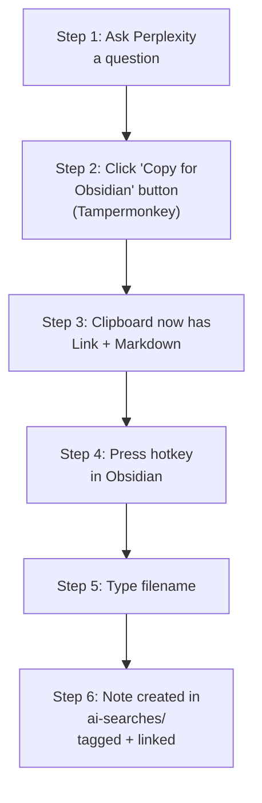

# Perplexity Saver

Ask Perplexity a research question, then save the entire conversation into your
vault with one click and one keystroke — automatically filed into a linked,
tagged note next to whatever you're currently writing. No copy-pasting, no
manual file creation, no frontmatter editing.



This works by pairing a small browser helper with this plugin — the browser
side copies the conversation in the right format, and this plugin handles
creating the note, tagging it, and linking it back into your current note.

## Setup

To get the one-click experience above, you need two quick installs: a browser
script (2 minutes) and this plugin.

### A. Browser setup (Tampermonkey)

1. Install the [Tampermonkey](https://www.tampermonkey.net/) browser extension.
2. Install the
   [Complexity](https://github.com/pnd280/complexity) Chrome extension, which
   adds full multi-turn dialog export to Perplexity's UI.
3. Open Tampermonkey's dashboard, click "Create a new script," and replace the
   contents with
   [`browser-userscript/perplexity-obsidian-exporter.user.js`](./browser-userscript/perplexity-obsidian-exporter.user.js)
   from this repo. Save it.
4. Visit perplexity.ai — you should see a small "📋 Copy for Obsidian" button
   appear in the bottom-right corner of the page.

### B. Obsidian plugin setup

1. Download or build this plugin (see "Building from source" below).
2. Copy the plugin folder into `<your vault>/.obsidian/plugins/`.
3. In Obsidian, go to Settings → Community plugins, disable Restricted mode if
    needed, refresh the plugin list, and enable "Perplexity Saver."
4. Go to Settings → Hotkeys, search "Save Perplexity Note," and assign a
   hotkey (e.g. Ctrl+Shift+V).

## Full workflow

1. **(Browser)** Ask your question(s) in Perplexity as normal.
2. **(Browser)** Click the "📋 Copy for Obsidian" button. This copies a
   Markdown version of the conversation, with a link back to the original
   Perplexity thread, to your clipboard.
 3. **(Obsidian)** Place your cursor in the note you're writing, where you want
    a link to the saved note to appear.
4. **(Obsidian)** Press your assigned hotkey.
5. **(Obsidian)** Type a filename when prompted, and press Enter.

The plugin then automatically creates a subfolder (default: `ai-searches`) in
the same folder as your current note (if it doesn't already exist). Then it saves
the clipboard content into a new note there, identifying it as written by AI with 
a tag (default: `ai-generated`), and inserts a link to it at your cursor position.

## Settings

- **AI save folder** (default: `ai-searches`) — The name of the subfolder where
  saved Perplexity notes are stored. It is automatically created in the same folder
  as the currently active note.
- **AI generated tag** (default: `ai-generated`) — The tag pushed into the frontmatter
  tags property of every saved AI note.

## Building from source

Requires [Node.js](https://nodejs.org).

```
npm install
npm run build
```

This produces `main.js`. Copy `manifest.json` and the built `main.js` into
`<your vault>/.obsidian/plugins/perplexity-saver/`.

## Troubleshooting

- **Nothing happens when I click "Copy for Obsidian":** Make sure the
  Complexity extension is installed and enabled, and that you're on a
  perplexity.ai conversation page (not the homepage).
- **Chrome asks for clipboard permission:** Allow it — the script needs to
  read back what was copied in order to prepend the Perplexity link.
- **Hotkey does nothing in Obsidian:** Confirm your cursor is inside an open
  note (the command requires an active editor), and check Settings → Hotkeys
  for a conflict with another plugin.
```

The diagram shown above uses a horizontal flow: Perplexity question → browser copy button → clipboard → Obsidian hotkey → filename prompt → final tagged, linked note — matching the six-step sequence described in the workflow section.
