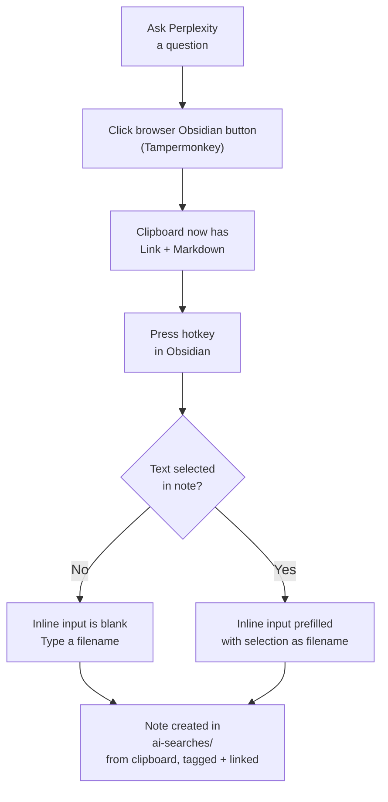

# Perplexity Saver

[](https://github.com/notuntoward/obsidian-perplexity-saver/actions/workflows/build.yml)
[](https://github.com/notuntoward/obsidian-perplexity-saver/actions/workflows/codeql.yml)
[](https://github.com/notuntoward/obsidian-perplexity-saver/actions/workflows/scorecard.yml)

Ask AI a research question, then save the entire conversation into your
vault with one click and one keystroke — automatically filed into a linked,
tagged note next to whatever you're currently writing. No copy-pasting, no
manual file creation, no frontmatter editing.  


```mermaid
flowchart TD
    A["Ask Perplexity<br/>a question"] --> B["Click browser Obsidian button<br/>(Tampermonkey)"]
    B --> C["Clipboard now has<br/>Link + Markdown"]
    C --> D["Press hotkey<br/>in Obsidian"]
    D --> E{"Text selected<br/>in note?"}
    E -->|No| F["Inline input is blank<br/>Type a filename"]
    E -->|Yes| G["Inline input prefilled<br/>with selection as filename"]
    F --> H["Note created in<br/>ai-searches/<br/>from clipboard, tagged + linked"]
    G --> H

    %% Define the smaller font style
    classDef smallFont font-size:13px;
    
    %% Assign the style to all nodes at once
    class A,B,C,D,E,F,G,H smallFont;
```

# Which AI?
## Perplexity

You can export single perplexity resposes from the default perplexity page, But full dialogs are available if you install the Complexity chrome plubin, a Perplexity companion plugin; a little more convenience can be had by also installing a small chrome tampermonkey script.

## Gemini

Whole dialogs are capturable when you install the obsidian web clipper browser plugin and set it to store to your clipboard

# Full workflow

1. **(Browser)** Ask your question(s) in Perplexity or Gemini as normal.
2. **(Browser)** Copy the conversation to your clipboard (Perplexity: click
   the "📋 Copy for Obsidian" button; Gemini: open the Obsidian Web
   Clipper, set destination to Clipboard, and click Copy).
3. **(Obsidian)** Place your cursor in the note you're writing, where you want
   a link to the saved note to appear.
4. **(Obsidian)** Press your assigned hotkey. An inline input field appears at
   your cursor position.
5. **(Obsidian)** Type a filename in the inline input. You can click elsewhere
   in the note to copy text, then return to the input to paste it — the input
   stays open and doesn't block interaction with the rest of the editor.
6. **(Obsidian)** Press Enter. The input is replaced with a link to the newly
   created note.

The note **content** always comes from the clipboard (the AI conversation
you copied). The plugin automatically creates a subfolder (default:
`ai-searches`) in the same folder as your current note (if it doesn't already
exist), saves the normalized clipboard content into a new note there, tags
it (default: `ai-generated`), and inserts a link to it at your cursor
position.

## Using selected text as the filename

If you have text selected in your note when you run the command, the plugin
uses the selected text as a suggested filename: the selection is deleted and the
inline input is pre-filled with it (auto-selected, so you can type over it
immediately). The note content still comes from the clipboard, not from the
selection. This is handy when you want the new note's name to match nearby text
in your current note.

Selecting text is purely a filename convenience — it never changes what gets
saved into the note body.

# The uniform note format

Every saved note uses the same markdown structure regardless of whether
the clipboard came from Perplexity or Gemini, so a single Obsidian query,
outline pane, or search works across all your AI dialogs.

```markdown
---
ai-dialog-format: v1
ai-source-vendor: perplexity
ai-source-url: https://www.perplexity.ai/search/...
tags: [ai-generated]
---

# Dialog

**Source:** [perplexity](https://www.perplexity.ai/search/...)

## How do I configure foo mode? ^turn-1-prompt

user's first question, with any leading "#" stripped

### AI response (turn 1) ^turn-1-ai

first AI response, with a trailing sources list removed

## Does it work with baz? ^turn-2-prompt

> Does it work with baz?

Explain.

### AI response (turn 2) ^turn-2-ai

follow-up response

# Sources

[^s1]: [Page title](https://url) (turn 1) <!-- src-url: https://url -->
[^s2]: [Page title](https://url) (turn 2) <!-- src-url: https://url -->
[^s3]: [Page title](https://url) (turns 1, 2) <!-- src-url: https://url -->
```

Key conventions:

- **Each turn has two headings.** The first is a level-2 **summary
  heading** derived from the prompt text (see "Headlines" below), with
  the permanent `^turn-N-prompt` block ID. The second is a level-3
  `### AI response (turn N)` heading with the permanent `^turn-N-ai`
  block ID. A prompt and the AI response immediately following it
  share one logical turn number; the next pair gets turn 2, and so on.
  The block IDs are what makes the pairing machine-readable, and the
  number is what makes the outline pane readable.
- **All citations from all turns go into a single `# Sources` section
  at the end.** Inline `[1]` markers in the AI response are rewritten
  to the note's own footnote IDs (`[^s1]`, `[^s2]`, etc.) so they
  click through to the entry. The same URL cited in two different turns
  is one source line with `(turns 1, 3)`, not two duplicate lines.
- **Each source line carries an invisible `<!-- src-url: ... -->` comment
  holding the original URL.** This is the stable key a future Zotero
  relinker uses to match an entry across notes, regardless of how the
  visible link above has been edited.
- **The inline `**Source:** [perplexity](url)` line at the top is
  clickable from both the editor and reading view.** It is also
  duplicated in frontmatter as `ai-source-vendor` and `ai-source-url`
  for programmatic access.
- **AI response body headings are demoted so the topmost lands at level
  4** (one level below the `### AI response` heading at level 3).
  This preserves the original heading hierarchy in the response
  without ever colliding with the structural turn headings.

# Headlines

Above each user prompt turn, the plugin inserts a level-2 summary
heading derived from the prompt text. This makes the Obsidian
outline pane show what each turn was about at a glance, rather
than a wall of identical "Prompt (turn N)" labels. Two selectable
algorithms are available (Settings → Headline method):

## Method 1: Lead sentence (default)

Uses `Intl.Segmenter` to split the prompt into sentences, then
adds sentences one at a time until adding another would exceed
`Headline max characters` (default 100). If the first sentence
is too long, it is truncated cleanly at a word boundary with an
ellipsis. No external dependencies; fast and deterministic.

## Method 2: TF-IDF ranked sentence

Tokenizes every sentence, drops stopwords, scores each by
TF-IDF with a configurable lead-position prior, and picks the
highest-scoring sentence. The `stopword` package is used for
scoring only; the returned headline is an original sentence
(not a stop-word-stripped keyword phrase), so it remains
grammatical. Two tunings (grayed out unless Method 2 is
selected):

- **Headline lead bias** (default 0.20): amount to favor
  sentences near the beginning. 0 disables the positional
  prior entirely; 0.20 is a gentle nudge toward the lead;
  0.30+ makes lead extraction dominate; 0.5+ effectively
  always picks the first sentence. This setting is grayed
  out in the settings tab unless "TF-IDF ranked sentence" is
  selected as the prompt heading method.
- **Headline max characters** (default 100): maximum length of
  the summary heading, including a possible ellipsis. 90–120
  is suitable for note titles and sidebar lists. At 60 or less
  the method is necessarily a truncator rather than a robust
  summarizer.

If both algorithms return an empty string (e.g. the prompt is
too short to yield a meaningful sentence), the plugin falls back
to a safe default of `Prompt (turn N)` so the heading is never
blank.

# Appending to a dialog

Long conversations come back in pieces. To continue a dialog:

1. **(Browser)** Continue the same thread in Perplexity or Gemini. Copy the
   new turn(s) to your clipboard the same way as for an import.
2. **(Obsidian)** Open the note you want to extend. Place your cursor anywhere
   in the note (it doesn't matter where — the command operates on the
   whole file).
3. **(Obsidian)** Run the **"Append AI dialog from clipboard to this note"**
   command (assign a hotkey in Settings → Hotkeys to make this fast).

What the command does:

- Parses the new clipboard content the same way an import does (vendor
  auto-detected: Perplexity or Gemini).
- Numbers the new turns starting at **one past the highest existing turn
  number** in the note. If the note ends with `### AI response (turn 2)
  ^turn-2-ai`, the appended turns become a level-2 summary heading
  `^turn-3-prompt` and a level-3 `### AI response (turn 3) ^turn-3-ai`.
- Splices the new turns into the note body, just before the `# Sources`
  heading (or at the end of the file if there's no Sources section yet).
- **Regenerates the entire `# Sources` block**, not just appends to it.
  This is required: if a new turn cites a URL that was already in
  `# Sources`, the existing entry's ownership list grows in place
  (e.g. `(turn 1)` becomes `(turns 1, 3)`), and a fresh source is
  minted only for genuinely new URLs. A pure tail-append could not
  preserve this.
- If the new clipboard has no turns the parser can recognize, the
  command fails with a notice and the file is not touched.

A status notice reports what happened:
`Appended 2 turn(s) and 1 new source(s).`

If the note has no `^turn-N-*` anchors (i.e. it was not created by this
plugin, or you hand-edited all turn headings away), the command refuses
with: "This note has no ^turn-N-* anchors. Use 'Import AI dialog from
clipboard' on a new note instead." Run the import command on a new
note first.

# Pruning orphaned sources

Each source line records which turn(s) introduced or cited it
(`(turn 1)` or `(turns 1, 3)`). If you edit a note and delete a
summary heading `## ... ^turn-1-prompt` together with its
`### AI response (turn 1) ^turn-1-ai` pair — for example, to remove an
embarrassing early prompt or compress a noisy stretch of the dialog —
the source(s) that only that turn referenced become orphaned. They
still sit in `# Sources` with a `(turn 1)` annotation pointing at a
heading that no longer exists.

To clean them up:

1. **(Obsidian)** Open the note. Place your cursor anywhere in the note.
2. **(Obsidian)** Run the **"Prune orphaned sources in this dialog
   note"** command.

A confirmation modal appears (see below) listing every source line that
references at least one deleted turn. Confirm with the button at the
bottom, or cancel.

## The two cases the modal distinguishes

The modal separates the action into two categories, so you can see at
a glance what will happen to each source before you commit:

### 1. Full removal — "will be removed"

The source's only citing turn was the one you deleted. The entire
source line is deleted from `# Sources`. Example wording:
> [^s2] [Help with PDF++ and text selection highlighting](https://...)
> - will be removed (only cited from turn 2, now deleted)

### 2. Partial adjustment — "will be kept, dropping its reference to deleted turn N"

The source was cited from multiple turns, and only one of those turns
was deleted. The line **stays** in `# Sources` (it is still cited by a
surviving turn, so the note's narrative still depends on it), but the
ownership annotation loses the dead turn. Example wording:
> [^s3] [BookBrowse Research & NEA Survey](https://...) -
> will be kept, dropping its reference to deleted turn 2
> (still cited from turn 1)

The button label reflects the mix:
- "Remove N source(s)" if everything is being deleted.
- "Adjust N source(s)" if everything is being kept but losing a turn
  reference.
- "Update N source(s) (X removed, Y adjusted)" if both are happening.

The command never runs without your confirmation. The modal also
distinguishes:
- **No orphans** — shows "No orphaned sources found. Nothing to
  remove." with only a Close button. Nothing happens to the file.

After you confirm, a notice reports the result:
`Removed 3 source(s), adjusted 2 other(s).`

# Settings

- **AI save folder** (default: `ai-searches`) — The name of the subfolder
  where saved AI notes are stored. It is automatically created in the same
  folder as the currently active note.
- **AI generated tag** (default: `ai-generated`) — The tag pushed into the
  frontmatter `tags` property of every saved AI note.
- **Collapse blank lines** (default: on) — When on, the note body is
  post-processed to remove blank lines immediately before and after every
  heading and to collapse any run of 2+ blank lines to one. Produces a
  denser, more uniform file. Turn this off if you prefer extra visual
  breathing room.

## Prompt heading

These three settings, grouped under the **Prompt heading** header in
the settings tab, control the level-2 summary heading above each user
prompt. See the [Headlines](#headlines) section above for the full
description of what they do.

- **Heading max characters** (default: 100) — Maximum length of the
  summary heading, including a possible ellipsis. 90–120 is suitable
  for note titles and sidebar lists. Used by both methods; always
  active.
- **Prompt heading method** (default: Lead sentence) — Algorithm for
  the summary heading. "Lead sentence" is the simple, fast default
  with no extra dependencies. "TF-IDF ranked sentence" requires the
  `stopword` package and is best for prompts where the most distinctive
  sentence is not the first one.
- **Heading lead bias** (default: 0.20) — TF-IDF only. Amount to favor
  sentences near the beginning. 0 disables the positional prior
  entirely; 0.20 is a gentle nudge toward the lead; 0.30+ makes lead
  extraction dominate. Grayed out unless "TF-IDF ranked sentence" is
  selected above, since it has no effect on the lead method.

# Setup

## A. Obsidian plugin setup

1. Download or build this plugin (see "Building from source" below).
2. Copy the plugin folder into `<your vault>/.obsidian/plugins/`.
3. In Obsidian, go to Settings → Community plugins, disable Restricted mode if
    needed, refresh the plugin list, and enable "Perplexity Saver."
4. Go to Settings → Hotkeys, search "Save Perplexity Note," and assign a
   hotkey (e.g. Ctrl+Shift+V).


## B. Tampermonkey script (Perplexity)

This works by pairing a small browser helper with this plugin — the browser
side copies the conversation in the right format, and this plugin handles
creating the note, tagging it, and linking it back into your current note.

To get the one-click experience above, you need two quick installs: a browser
script (2 minutes) and this plugin.

#### Tampermonkey browser setup

1. Install the [Tampermonkey](https://www.tampermonkey.net/) browser extension.
2. Install the
   [Complexity](https://github.com/pnd280/complexity) Chrome extension, which
   adds full multi-turn dialog export to Perplexity's UI.
3. Open Tampermonkey's dashboard, click "Create a new script," and replace the
   contents with
   [`browser-userscript/perplexity-obsidian-exporter.user.js`](./browser-userscript/perplexity-obsidian-exporter.user.js)
   from this repo. Save it.
4. In Chrome, go to `chrome://extensions` → **Tampermonkey** → **Details**:
   - Set **Site access** to **On all sites** (or explicitly allow
     `https://www.perplexity.ai`).
   - Turn on **Allow user scripts**.
   - Confirm Tampermonkey itself is enabled.
5. Visit perplexity.ai — you should see a small "📋 Copy for Obsidian" button
   appear in the bottom-right corner of the page.

## C. Obsididan web clipper (for Gemini)

Install the official **Obsidian Web Clipper** from your browser’s extension store and pin it to the toolbar.

On any page, open the clipper, select **Settings** (gear), and set the destination/action to **Clipboard**. Then choose **Copy** to place the generated Markdown on your clipboard, ready to paste anywhere, but don't paste, use this plugin to save the dialog instead.


# Building from source

Requires [Node.js](https://nodejs.org).

```
npm install
npm run build
```
This produces `main.js`. Copy `manifest.json` and the built `main.js` into
`<your vault>/.obsidian/plugins/perplexity-saver/`.

# Troubleshooting

## First checks

If the button does not appear on Perplexity, check these before anything else:

1. Open a Perplexity tab, click the Tampermonkey extension icon, and make sure
   this script is shown as active/running.
2. Go to `chrome://extensions` → **Tampermonkey** → **Details**:
   - Confirm Tampermonkey is enabled.
   - Set **Site access** to **On all sites** (or explicitly permit
     `https://www.perplexity.ai`).
   - Turn on **Allow user scripts**.
3. In the Tampermonkey Dashboard, make sure the script's enable toggle is on,
   then reload Perplexity with a full reload: `Ctrl+Shift+R`.

A Chrome update can reset these permissions. If site access is set to **On
click**, the script cannot inject the button automatically.

### Confirm the script is running

Open the browser's developer tools (`F12`) and switch to the **Console** tab.
When you reload Perplexity you should see a line like:

```
[PPLX Obsidian exporter] userscript started https://www.perplexity.ai/...
```

If the line does not appear, the script is not being injected at all — go back
to the First checks section above. If the line appears but the button is still
missing, look for a red error in the Console and report it.

## Other common issues

- **Nothing happens when I click "Copy for Obsidian":** Make sure the
  Complexity extension is installed and enabled, and that you're on a
  perplexity.ai conversation page (not the homepage).
- **Chrome asks for clipboard permission:** Allow it — the script needs to
  read back what was copied in order to prepend the Perplexity link.
- **Hotkey does nothing in Obsidian:** Confirm your cursor is inside an open
  note (the command requires an active editor), and check Settings → Hotkeys
  for a conflict with another plugin.
