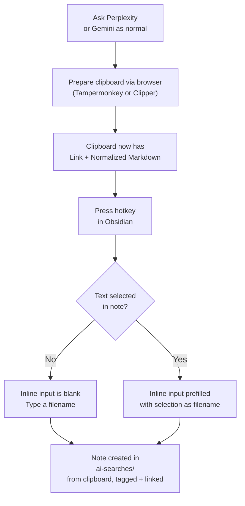

# Perplexity Saver

[](https://github.com/notuntoward/obsidian-perplexity-saver/actions/workflows/build.yml)
[](https://github.com/notuntoward/obsidian-perplexity-saver/actions/workflows/codeql.yml)
[](https://github.com/notuntoward/obsidian-perplexity-saver/actions/workflows/scorecard.yml)

Ask AI a research question, then save the entire conversation into your
vault with one click and one keystroke — automatically filed into a linked,
tagged note next to whatever you're currently writing. No copy-pasting, no
manual file creation, no frontmatter editing. Sources can then be matched
against your local [Zotero](https://www.zotero.org/) library and vault
literature notes, turning every citation into a jumpable link.  


```mermaid
flowchart TD
    A["Ask Perplexity<br/>or Gemini as normal"] --> B["Prepare clipboard via browser<br/>(Tampermonkey or Clipper)"]
    B --> C["Clipboard now has<br/>Link + Normalized Markdown"]
    C --> D["Press hotkey<br/>in Obsidian"]
    D --> E{"Text selected<br/>in note?"}
    E -->|No| F["Inline input is blank<br/>Type a filename"]
    E -->|Yes| G["Inline input prefilled<br/>with selection as filename"]
    F --> H["Note created in<br/>ai-searches/<br/>from clipboard, tagged + linked"]
    G --> H

    %% Define the smaller font style
    classDef smallFont font-size:13px;
    
    %% Assign the style to all nodes at once
    class A,B,C,D,E,F,G,H smallFont;
```

# Supported AI Vendors & Workflow

This plugin supports saving and appending dialogs from both **Perplexity** and **Gemini**. The key is to get the conversation into your clipboard using the appropriate method for each platform, after which the Obsidian plugin processes and formats it identically.

---

## 1. Perplexity Workflow

With Perplexity, you can enjoy an automated workflow using a browser UserScript (via Tampermonkey). It intercepts Perplexity’s standard "Export as Markdown" download action, robustly aligns prompt-response boundaries, adds the source URL and timestamps, and copies the finalized markdown directly to your clipboard.

### Exporting (Perplexity)
1. While viewing your thread on Perplexity, click the **three dots (`...`)** menu at the top-right or bottom of the page.
2. Select **Export as Markdown**.
3. Instead of downloading a file, the direct UserScript intercepts the action, automatically handles collapsed prompts (expanding "show more" sections so they aren't lost), aligns prompt/response boundaries, copies the complete annotated markdown to your clipboard, and displays a temporary green toast saying `"Copied annotated export to clipboard"`.

*(If you haven't installed the Tampermonkey script yet, see the [Installation & Setup](#installation--setup) section below).*

---

## 2. Gemini Workflow

For Gemini, you copy the formatted dialog into your clipboard using the official Obsidian Web Clipper extension.

### Exporting (Gemini)
1. Ask your questions in Gemini as normal.
2. Click the **Obsidian Web Clipper** icon in your browser toolbar. A popup will appear showing the markdown it has extracted from the current Gemini thread.
3. Scroll to the bottom of the clipper popup and click the **Copy to Clipboard** button.
4. Your clipboard is now ready for the Obsidian plugin.

*(If you haven't installed the Obsidian Web Clipper yet, see the [Installation & Setup](#installation--setup) section below).*

---

## 3. Obsidian Saving & Linking

Once the conversation markdown is on your clipboard (via Perplexity's Export menu or Gemini's Web Clipper):

1. **Place your cursor** in the Obsidian note where you want a link to the saved AI dialog to appear.
2. **Press your hotkey** (e.g., `Ctrl+Shift+V` or whatever you bound to "Import AI dialog from clipboard"). An inline input field appears directly at your cursor position.
3. **Type a filename** (or use selected text as the filename, see below). You can click elsewhere in the note to copy text, then return to the input to paste it — the input stays open and doesn't block interaction with the rest of the editor.
4. **Press Enter**. The input is replaced with a link to the newly created note.

The plugin automatically:
- Identifies the source vendor (Perplexity or Gemini).
- Creates a subfolder (default: `ai-searches`) in the folder of your current note if it doesn't exist.
- Saves the normalized, structured conversation into a new note there.
- Tags it (default: `ai-generated`) in the frontmatter.
- Inserts a link to it at your cursor position.

### Using selected text as the filename
If you select text in your note *before* pressing the hotkey, the plugin uses the selected text as the suggested filename: the selection is cleared and the inline input is pre-filled with it (auto-selected so you can type over it immediately). The note content still comes from the clipboard, not the selection.

---

# The Universal AI Format

No matter whether you copy your conversation from Perplexity or Gemini, the Obsidian plugin parses and converts the content into a single **Universal AI Format**. This makes sure that your entire corpus of AI research has a uniform markdown structure, allowing a single Obsidian query, dataview block, outline pane, or tag search to work seamlessly across all of your dialogs.

Below is an annotated example of this universal structure, followed by specific details on how it is parsed and structured:

```markdown
---
ai-dialog-format: v1
ai-source-vendor: perplexity
ai-source-url: https://www.perplexity.ai/search/...
tags: [ai-generated]
---

[Perplexity](https://www.perplexity.ai/search/...) · *2026-10-24 14:32 EST*

# Dialog

## How do I configure foo mode? ^turn-1

> [!Prompt]+
> How do I configure foo mode?
> 
> Explain.

first AI response, with citation markers mapped to footnote-style links[^1_1].

## Does it work with baz? ^turn-2

> [!Prompt]+
> > Does it work with baz?
>
> Explain.

follow-up response citing another source[^2_14].

# Sources

[^1_1]: [Page title](https://url-one)
[^2_14]: <https://www.reddit.com/r/learnprogramming/comments/pymrss/can_someone_for_the_love_of_god_explain_what_git/>
```

## Structure Rules & Technical Specs (for AI / Parsers)

This format is structured to be machine-readable yet highly readable in standard markdown parsers and Obsidian previews. If an AI or program wants to write or parse this format, these are the exact rules:

1. **Frontmatter**:
   - `ai-dialog-format`: String specifying the format version (currently `v1`).
   - `ai-source-vendor`: Either `perplexity` or `gemini`.
   - `ai-source-url`: The direct web link back to the conversation thread.
   - `tags`: An array containing user-configured tags (default: `[ai-generated]`).

2. **Source Metadata Preamble**:
   - Located directly above `# Dialog`.
   - Formatted as: `[Vendor](URL) · *Timestamp*` (e.g., `[Perplexity](https://...) · *2026-10-24 14:32 EST*`).

3. **Dialogue Turns (`^turn-N`)**:
   - Each QA interaction is a single "turn" identified by a turn index `N` starting at `1` (e.g., `turn-1`, `turn-2`).
   - Every turn starts with a level-2 heading (`##`) representing the prompt headline summary (see headlines section).
   - The level-2 heading line must end with a block ID anchor in the exact format: `^turn-N`.
   - Following the heading, the user prompt is wrapped inside a folded Obsidian callout block (`> [!Prompt]+` or `> [!Prompt]-`). Each line of the prompt is prefixed with `> ` so that the entire prompt can be collapsed/expanded by clicking in the preview.

4. **Response Heading Demotion**:
   - To prevent headings within the AI's response from cluttering the note's top-level outline, any headings inside the AI response are dynamically demoted so the highest heading starts at level 3 (`###` or lower).

5. **Turn-Scoped Footnote Citations**:
   - Inline citation markers in the AI response are rewritten from raw brackets (e.g., `[1]`, `[14]`) into standard markdown footnote markers (e.g., `[^1_1]`, `[^2_14]`).
   - The footnote key format is `[^turnNumber_sourceNumber]`. For example, in `[^9_14]`, `9` is the logical turn number (corresponding to the `^turn-9` heading block) and `14` is the source citation number within that turn.
   - All citations listed in the original export (including those provided by Perplexity that may not be directly cited inside the response text) are captured and mapped.

6. **The `# Sources` Section**:
   - Located at the very bottom of the document.
   - Contains a standard markdown footnote list.
   - Each footnote corresponds to the turn-scoped footnote keys, formatted as standard markdown links:
     - Formatted as `[^turnNumber_sourceNumber]: [Title](URL)` or simply `[^turnNumber_sourceNumber]: <URL>` if no title is present.
   - After [Zotero relinking](#zotero--literature-note-relinking), entries may instead be bold `zotero://` item links or bold literature-note wikilinks; the footnote key and turn-ownership semantics are unchanged.

---

# Headlines

To prevent your Obsidian outline pane from displaying a repetitive wall of "Prompt (turn N)" labels, the plugin inserts a summarizing level-2 heading (`##`) above each prompt. You can configure this via **Settings → Headline method**:

- **Method 1: Lead sentence (default)**: Splits the prompt into sentences and uses the first sentence that fits within the configured length limit (truncating at word boundaries if the first sentence is too long). Fast and deterministic.
- **Method 2: TF-IDF ranked sentence**: Tokenizes prompt sentences, scores each based on term salience (TF-IDF) combined with a configurable lead-position bias, and selects the highest-scoring sentence. Requires the `stopword` package.

---

# Continuing, Appending & Syncing a Dialog

If you continue a conversation in your browser and want to save the new turns into the existing note:

1. **(Browser)** Ask follow-up questions in Perplexity or Gemini. Copy the updated conversation to your clipboard using the same method (Export as Markdown in Perplexity, or the Web Clipper in Gemini).
2. **(Obsidian)** Open the existing note in your vault. Place your cursor anywhere in the file.
3. **(Obsidian)** Run the command: **"Sync AI dialog from clipboard"** (assign a hotkey to make this fast).

### What Syncing Does:
- It auto-detects the vendor (Perplexity/Gemini) of your clipboard.
- It reads the `ai-source-turns-synced` YAML watermark from the note's frontmatter (falling back to the highest surviving `^turn-N` anchor if missing) to know exactly how many turns have already been synced.
- It slices the incoming clipboard conversation, only appending the genuinely *new* turns.
- It starts numbering new local anchors sequentially at `max(existing ^turn-N anchors) + 1`, making your local numbering robust and monotonic even if earlier turns were deleted.
- It appends the new turns directly before the `# Sources` heading.
- It **completely regenerates and merges the `# Sources` section** to ensure all citations from old and new turns are consolidated, mapped correctly, and deduplicated.
- If the **Auto-relink sources** setting is on, it relinks the regenerated `# Sources` section against your Zotero library and literature notes in the same pass (see [Zotero & Literature Note Relinking](#zotero--literature-note-relinking)).
- It updates the `ai-source-turns-synced` watermark to reflect the new total number of synced turns.

> [!NOTE] Known Limitation
> If you edit or regenerate an earlier prompt directly on the source Perplexity/Gemini page (not just ask new questions), the plugin cannot detect this — syncing only looks at the turn count, not turn content. This is a known limitation; re-export manually if this happens.

---

# Pruning and Removing Sources

This plugin provides several convenient commands to help keep your notes and `# Sources` clean and relevant. Since they execute immediately and can be easily undone using standard Obsidian undo commands (`Ctrl+Z`), no confirmation modal is shown.

### Deleting a Dialog Turn

To remove an entire turn (its summary heading, prompt callout, and AI response), run the command: **"Delete AI dialog turn"**. It opens a fuzzy-searchable list of every turn in the note; pick one and the plugin removes the whole block, then cleans up `# Sources` — sources cited only by the deleted turn are removed entirely, while sources still cited by other turns are kept with just the stale turn reference dropped.

### 1. Removing Sources with No Dialog
If you manually delete a turn (e.g., removing a prompt callout and its accompanying AI response to tidy up a note), the citations tied exclusively to that turn will remain in the `# Sources` block at the bottom.

To clean this up, run the command: **"Remove sources with no dialog"**.
- **Full removal**: If a source was only cited by the deleted turn, it is deleted entirely.
- **Partial adjustment**: If a source is still cited by other surviving turns, it is kept but its metadata reference to the deleted turn is removed.

### 2. Removing Sources with No Cite
If you edit an AI response and delete the footnote citation reference (e.g. removing `[^1_1]` from the response text), the source link itself remains under `# Sources`.

To clean this up, run the command: **"Remove sources with no cite"**.
- This scans all logical dialog turns, extracts the AI response parts, and identifies any source lines under `# Sources` that are no longer cited in any AI response.
- Any completely uncited sources are removed immediately from the note.

---

# Zotero & Literature Note Relinking

Every entry under `# Sources` can be promoted from a plain web link into a **Zotero item link** or an **Obsidian literature-note link**:

- **Zotero item link** — `**[Title ➔ ZOTKEY](zotero://select/library/items/ZOTKEY)**`. Clicking it jumps straight to the item in your local Zotero library.
- **Literature note link** — `**[[citekey|Title ➔ citekey]]**`. Clicking it opens the vault note that corresponds to the citekey.

Sources are matched to Zotero items first by exact (normalized) URL, then by fuzzy title similarity against a configurable minimum score. When a Zotero item is found and a literature note with the item's citekey exists in your vault, the source becomes a literature-note link; otherwise it becomes a Zotero item link. The original URL is preserved so sources can be re-matched after new items are added.

## Prerequisites

- **Zotero 7 or newer** running locally with the **Local API** enabled (Zotero → Settings → Advanced → Allow other applications on this computer to communicate with Zotero).
- **Better BibTeX** (optional, recommended): provides reliable citekeys via the `item.citationkey` JSON-RPC method. Without it the plugin falls back to Zotero's native API and any citation keys in item metadata.
- **Obsidian literature notes** (optional): any vault note whose basename matches a citekey (e.g. `smith2024climate.md` for citekey `smith2024climate`). Only notes inside the configured **Literature notes folder** are considered first; if none match there, the whole vault is searched as a fallback.

## Commands

- **"Relink sources with Zotero"** — manually relinks the current note's `# Sources` section. Shows a live progress notice and reports how many sources were matched (split into Zotero items vs. literature notes). If nothing new matches, the note is left untouched.
- **"Auto-relink sources" setting** — when enabled, relinking runs automatically at the end of **"Import AI dialog from clipboard"** and **"Sync AI dialog from clipboard"** (the two commands that create new turns). Auto-relinking is best-effort: if Zotero is not running or the library is unreachable, the import/sync still completes and the note is saved with the un-relinked sources.

---

# Settings Configuration

- **AI save folder** (default: `ai-searches`): Folder name where notes are created (relative to your currently active note).
- **AI generated tag** (default: `ai-generated`): Tag inserted into the frontmatter.
- **Collapse blank lines** (default: on): Collapses consecutive blank lines into a single blank line to make the note structure clean and dense.
- **Collapse prompt callouts** (default: on): When on, user prompts start collapsed (`> [!Prompt]+`). When off, they start expanded (`> [!Prompt]-`).
- **Prompt heading**:
  - **Heading max characters** (default: `100`): Maximum length for the summary heading.
  - **Prompt heading method** (default: `Lead sentence`): Choice between `Lead sentence` and `TF-IDF ranked sentence`.
  - **Heading lead bias** (default: `0.20`): TF-IDF only. Determines how much to favor sentences closer to the start of the prompt.
- **Source link title shortening**:
  - **Auto-fetch source titles** (default: on): Fetches webpage titles for sources that don't already have one, producing clean markdown links instead of bare URLs.
  - **Source title max characters** (default: `100`): Maximum length of a fetched source link title, including a possible ellipsis.
- **Zotero & Literature Note Relinking** (see [above](#zotero--literature-note-relinking)):
  - **Auto-relink sources** (default: off): Automatically run Zotero relinking when importing or syncing new turns.
  - **Zotero HTTP Port** (default: `23119`): Local HTTP port for the Zotero 7 Local API.
  - **Literature notes folder** (default: `lit/lit_notes`): Vault folder where literature notes reside. Leave blank to search anywhere in the vault.
  - **Minimum title match score** (default: `95`): Minimum fuzzy similarity score (0-100) required to match an AI source title to a Zotero item.
  - **Zotero library cache**: Button to clear the in-memory cached Zotero library so the next relink fetches fresh from Zotero.

---

# Installation & Setup

### A. Obsidian Plugin Setup
1. Download or build this plugin (see "Building from source" below).
2. Copy the plugin folder into your vault under `<your vault>/.obsidian/plugins/`.
3. In Obsidian, go to **Settings → Community plugins**, disable Restricted mode if needed, refresh the plugin list, and enable **Perplexity Saver**.
4. Go to **Settings → Hotkeys**, search "Import AI dialog from clipboard", and assign a hotkey (e.g., `Ctrl+Shift+V`).

### B. Perplexity UserScript Setup (Tampermonkey)
To set up the automated boundary-aligning "Direct" exporter:
1. Install the [Tampermonkey](https://www.tampermonkey.net/) browser extension.
2. Open Tampermonkey's dashboard, click "Create a new script," and replace the default code with the contents of [`browser-userscript/perplexity-obsidian-exporter-direct.user.js`](./browser-userscript/perplexity-obsidian-exporter-direct.user.js) from this repository. Save it.
3. In your browser's extension settings (e.g. `chrome://extensions` → **Tampermonkey** → **Details**):
   - Confirm Tampermonkey is enabled.
   - Set **Site access** to **On all sites** (or explicitly permit `https://www.perplexity.ai`).
   - Turn on **Allow access to file URLs** and/or **Allow user scripts** depending on your browser.
4. Reload your Perplexity tab. When you click **Export as Markdown** inside Perplexity, the UserScript will run and process the export automatically.

### C. Gemini Web Clipper Setup
1. Install the official **Obsidian Web Clipper** from your browser’s extension store.
2. Open the clipper, click the gear icon to open **Settings**, and set the destination/action to **Clipboard**.

---

# Building from Source

Requires [Node.js](https://nodejs.org).

```bash
npm install
npm run build
```
This compiles the code into `main.js`. Copy `manifest.json`, the compiled `main.js`, and `styles.css` into your vault under `.obsidian/plugins/perplexity-saver/`.

---

# Credits

- Thanks to [Tampermonkey](https://www.tampermonkey.net/) chrome extension
- Zotero connections inspired by [Zotero Bridge](https://github.com/vanakat/zotero-bridge) by vanakat

# Deprecated Workflows & Legacy Interfaces

*The following sections outline older browser extensions and Tampermonkey configurations which are no longer recommended but remain supported for backward compatibility.*

### Complexity Chrome Extension & Older Tampermonkey Script
Previously, exporting multi-turn dialogs from Perplexity required installing the "Complexity" Chrome companion plugin along with an older script. While still functional, this has been deprecated in favor of the **Direct & Robust UserScript** (`perplexity-obsidian-exporter-direct.user.js`), which has zero dependencies, does not require the "Complexity" extension, and operates directly inside Perplexity's native export menu.

If you are still using Complexity:
1. Install the [Complexity](https://github.com/pnd280/complexity) Chrome extension.
2. In Tampermonkey, use the [`browser-userscript/perplexity-obsidian-exporter.user.js`](./browser-userscript/perplexity-obsidian-exporter.user.js) script instead.
3. This adds a floating circular "📋 Copy for Obsidian" button near the bottom right of Perplexity, which triggers the Complexity popup and copies the formatted thread.
