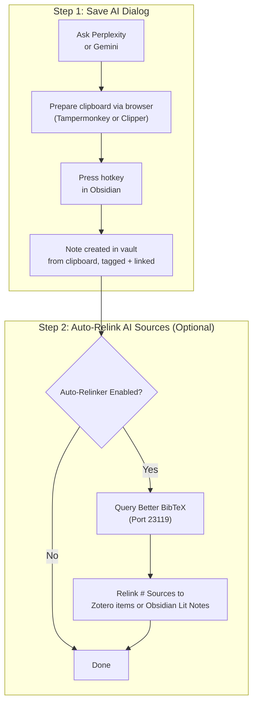
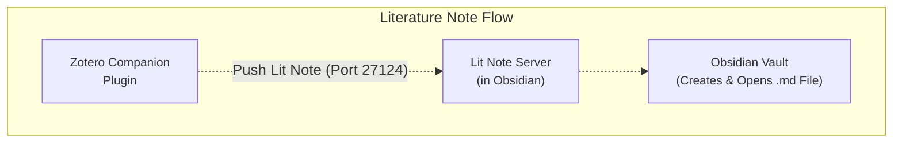

# Obsidian Perplexity Saver

[](https://github.com/notuntoward/obsidian-perplexity-saver/actions/workflows/build.yml)
[](https://github.com/notuntoward/obsidian-perplexity-saver/actions/workflows/codeql.yml)
[](https://github.com/notuntoward/obsidian-perplexity-saver/actions/workflows/scorecard.yml)
[](https://securityscorecards.dev/viewer/?uri=github.com/notuntoward/obsidian-perplexity-saver)

This plugin saves conversational threads from Perplexity.ai into your Obsidian vault, retaining proper Markdown formatting, deep-linking citations to footnotes, and generating clean metadata headers for fast search and archival.

It also supports rich integration with Zotero 7/8/9 to automatically link your Perplexity sources to your local Zotero library, and allows creating Zotero literature notes directly into Obsidian via a companion Zotero plugin.



```mermaid
flowchart TD
    %% Use subgraphs to create "rows" for a wrapping/snaking layout
    subgraph Row1 ["Step 1: Save AI Dialog"]
        direction LR
        A["Ask Perplexity<br/>or Gemini"] --> B["Prepare clipboard via browser<br/>(Tampermonkey or Clipper)"]
        B --> C["Press hotkey<br/>in Obsidian"]
        C --> H["Note created in vault<br/>from clipboard, tagged + linked"]
    end

    subgraph Row2 ["Step 2: Auto-Relink AI Sources (Optional)"]
        direction LR
        I{"Auto-Relinker Enabled?"} -->|Yes| J["Query Better BibTeX<br/>(Port 23119)"]
        J --> K["Relink # Sources to<br/>Zotero items or Obsidian Lit Notes"]
        I -->|No| L["Done"]
        K --> L
    end

    %% Connect the end of Row 1 to the start of Row 2
    H --> I

    %% Define the smaller font style
    classDef smallFont font-size:13px;
    class A,B,C,H,I,J,K,L smallFont;
```


```mermaid
flowchart TD
    subgraph Literature Note Flow
    Zot["Zotero Companion<br/>Plugin"] -. "Push Lit Note (Port 27124)" .-> M["Lit Note Server<br/>(in Obsidian)"]
    M -.-> N["Obsidian Vault<br/>(Creates & Opens .md File)"]
    end

    %% Define the smaller font style
    classDef smallFont font-size:13px;
    class M,N,Zot smallFont;
```

---

# Zotero & Literature Note Integration

This plugin serves as the Obsidian backbone for a complete literature note and citation workflow with Zotero. It provides two main features: 
1. **Source Relinking**: Automatically matches and relinks `# Sources` in your Perplexity saves to your local Zotero items or existing literature notes.
2. **Local HTTP Server**: Runs a zero-configuration local server on port `27124` that allows Zotero to instantly push new literature notes directly into your vault.

### Prerequisites & Dependencies
- **Zotero 7/8/9** running locally.
- **[Zotero Obsidian Companion](https://github.com/notuntoward/zotero-obsidian-companion)**: The companion plugin installed in Zotero 7/8/9. (This provides the "Create Lit Note" command, among others, in Zotero).
- **Zotero Local API enabled**: Check `Zotero -> Settings -> Advanced -> Allow other applications on this computer to communicate with Zotero`.
- **Better BibTeX** (optional, highly recommended): Provides reliable citekeys.

### Commands

- **"Import AI dialog from clipboard"** - parses clipboard text into a new note with formatted callouts and sources.
- **"Sync AI dialog from clipboard"** - appends new turns to the active note.
- **"Sync linked AI dialog from clipboard"** - identical to the sync command, but runs on the dialog note linked at your current cursor position (e.g. inside `[[My Dialog]]`), allowing you to sync new turns without leaving your referencing note.
- **"Jump to turn response"** - opens a fuzzy-searchable popup of the current dialog's headings, instantly jumping your cursor to the start of the AI's response for the selected turn. The turn you are currently reading is marked with a subtle box.
- **"Relink sources with Zotero"** - manually relinks the current note's `# Sources` section. Shows a live progress notice and reports how many sources were matched (split into Zotero items vs. literature notes). If nothing new matches, the note is left untouched.
- **"Auto-relink sources" setting** - when enabled, relinking runs automatically at the end of **"Import AI dialog from clipboard"** and **"Sync AI dialog from clipboard"** (the two commands that create new turns).

---

# Settings Configuration

### AI Import Settings
- **AI save folder** (default: `ai-searches`): Folder name where notes are created (relative to your currently active note).
- **AI generated tag** (default: `ai-generated`): Tag inserted into the frontmatter.
- **Collapse blank lines** (default: on): Collapses consecutive blank lines into a single blank line to make the note structure clean and dense.
- **Collapse prompt callouts** (default: on): When on, user prompts start collapsed (`> [!Prompt]+`). When off, they start expanded (`> [!Prompt]-`).

### Prompt Heading Formatting
- **Heading max characters** (default: `100`): Maximum length for the summary heading.
- **Prompt heading method** (default: `Lead sentence`): Choice between `Lead sentence` and `TF-IDF ranked sentence`.
- **Heading lead bias** (default: `0.20`): TF-IDF only. Determines how much to favor sentences closer to the start of the prompt.

### Source Link Title Fetching
- **Auto-fetch source titles** (default: on): Fetches webpage titles for sources that don't already have one, producing clean markdown links instead of bare URLs.
- **Source title max characters** (default: `100`): Maximum length of a fetched source link title, including a possible ellipsis.

### Zotero & Literature Note Relinking
- **Auto-relink sources** (default: off): Automatically run Zotero relinking when importing or syncing new turns.
- **Zotero HTTP Port** (default: `23119`): Local HTTP port for the Zotero 7/8/9 Local API.
- **Literature notes folder** (default: `lit/lit_notes`): Vault folder where literature notes reside (and where new notes sent from the Zotero companion plugin are saved). Leave blank to search anywhere in the vault.
- **Minimum title match score** (default: `95`): Minimum similarity score (0-100) required to match an AI source to a Zotero item.
- **Zotero library cache**: Button to clear the in-memory cached Zotero library so the next relink fetches fresh from Zotero.

*(Note: The local HTTP port `27124` that listens for literature notes from Zotero is completely zero-configuration and runs automatically in the background).*

---

# Data Formats

### Expected Clipboard Format
The Obsidian plugin parses clipboard content generated by the export scripts. It expects standard Markdown containing:

1. **Metadata Header**: The script must prepend a line starting with `[Perplexity](URL)` at the very beginning of the text to identify the source and trigger the Perplexity parser.
2. **Conversation Turns**: For stock Perplexity exports, prompt/response pairs should be separated by horizontal rules (`---` or `***`). The user's prompt is typically formatted as a Markdown heading (e.g. `# Prompt Text`) or separated by a blank line.
3. **Citations (Optional)**: A trailing section beginning with `# Citations:` or `**Sources:**` containing numbered markdown links (e.g., `[1] https://example.com`).

*(Note: The plugin also supports an annotated format containing `<!-- PPLX-TURN n -->` comments for more precise boundary alignment).*

### Final Saved Note Format
When the plugin imports a dialog, it constructs a highly structured Obsidian note formatted for readability and Zotero integration:

- **Source Metadata**: A clean link to the original conversation at the top of the note.
- **`# Dialog` Section**: The main conversation history.
  - **Prompts** are rendered as Obsidian callouts (e.g. `> [!Prompt]+`) to distinguish them visually from AI text. They are prefixed with a summary heading containing a block reference anchor (e.g. `### Summary of prompt ^t1`).
  - **AI Responses** follow immediately as standard Markdown, with their inline citation markers (e.g. `[1]`) rewritten to point cleanly to the aggregated sources at the bottom.
- **`# Sources` Section**: An aggregated list of all citations used in the conversation, formatted as Obsidian footnotes/links. These can be automatically relinked to Zotero literature notes using the plugin's commands.

---

# Installation & Setup

### A. Obsidian Plugin Setup
*(See "Building from Source" below if you want to install from source).*

1. Download the latest release from the Releases page.
2. Unzip and copy the folder into your vault under `<your vault>/.obsidian/plugins/`.
3. In Obsidian, go to **Settings -> Community plugins**, disable Restricted mode if needed, refresh the plugin list, and enable **Perplexity Saver**.
4. Go to **Settings -> Hotkeys**, search "Import AI dialog from clipboard", and assign a hotkey (e.g., `Ctrl+Shift+V`).

### B. Perplexity UserScript Setup (Tampermonkey)
To set up the automated boundary-aligning "Direct" exporter:
1. Install the [Tampermonkey](https://www.tampermonkey.net/) browser extension.
2. Open Tampermonkey's dashboard, click "Create a new script," and replace the default code with the contents of [`browser-userscript/perplexity-obsidian-exporter-direct.user.js`](./browser-userscript/perplexity-obsidian-exporter-direct.user.js) from this repository. Save it.
3. In your browser's extension settings (e.g. `chrome://extensions` -> **Tampermonkey** -> **Details**):
   - Confirm Tampermonkey is enabled.
   - Set **Site access** to **On all sites** (or explicitly permit `https://www.perplexity.ai`).
   - Turn on **Allow access to file URLs** and/or **Allow user scripts** depending on your browser.
4. Reload your Perplexity tab. When you click **Export as Markdown** inside Perplexity, the UserScript will run and process the export automatically.

### C. Gemini Web Clipper Setup
1. Install the official **Obsidian Web Clipper** from your browser's extension store.
2. Open the clipper, click the gear icon to open **Settings**, and set the destination/action to **Clipboard**.

---

# Building from Source

This project uses standard Node.js tooling.

```bash
# 1. Clone the repository
git clone https://github.com/notuntoward/obsidian-perplexity-saver.git
cd obsidian-perplexity-saver

# 2. Install dependencies (requires Node.js 18+)
npm install

# 3. Build the production files
npm run build
```

Once built, you need to manually copy the required distribution files into your Obsidian vault:
1. Create a folder in your vault: `<your_vault>/.obsidian/plugins/perplexity-saver/`
2. Copy the following three files into that new folder:
   - `main.js` (generated by the build)
   - `styles.css` (if it exists)
   - `manifest.json`
3. Restart Obsidian (or reload plugins) and enable it in the Community Plugins tab.

---

# Troubleshooting & Edge Cases

### Multi-Paragraph Prompts and Boundary Detection
Perplexity's markdown exporter fundamentally lacks boundaries between user prompts and AI responses (they are just separated by blank lines). To reliably parse threads, the UserScript must identify the true prompt text by reading Perplexity's internal React state tree or falling back to a DOM sibling scan.

If you edit a multi-paragraph prompt, or if Perplexity breaks the prompt into multiple content blocks in their internal state, the script handles this gracefully by scanning the entire conversation tree for the **longest matching message** that shares the same heading, and unpacking any array-based text blocks. This guarantees that no paragraphs are accidentally orphaned into the AI response.

In the event of a catastrophic scraper failure (where both React state and DOM extraction fail), the script falls back to purely guessing boundaries from the raw Markdown. To ensure that **pages-long prompts** are never accidentally swallowed by the AI response, this text-guesser is strictly bounded: it will only walk backwards over paragraphs that definitively start with known AI intro phrases (e.g., "Here is", "Certainly"), and it will instantly stop if it hits a paragraph ending in a question mark.

---

# Credits

- Thanks to [Tampermonkey](https://www.tampermonkey.net/) chrome extension
- Zotero connections inspired by [Zotero Bridge](https://github.com/vanakat/zotero-bridge) by vanakat

# Deprecated Workflows & Legacy Interfaces

*The following sections outline older browser extensions and Tampermonkey configurations which are no longer recommended but remain supported for backward compatibility.*

### Complexity Chrome Extension & Older Tampermonkey Script
Previously, exporting multi-turn dialogs from Perplexity required installing the "Complexity" Chrome companion plugin along with an older script. While still functional, this has been deprecated in favor of the **Direct & Robust UserScript** (`perplexity-obsidian-exporter-direct.user.js`), which has zero dependencies, does not require the "Complexity" extension, and operates directly inside Perplexity's native export menu.

If you are still using Complexity:
1. Install the [Complexity](https://github.com/pnd280/complexity) Chrome extension.
2. In Tampermonkey, use the [`browser-userscript/perplexity-obsidian-exporter.user.js`](./browser-userscript/perplexity-obsidian-exporter.user.js) script instead.
3. This adds a floating circular "📝 Copy for Obsidian" button near the bottom right of Perplexity, which triggers the Complexity popup and copies the formatted thread.
